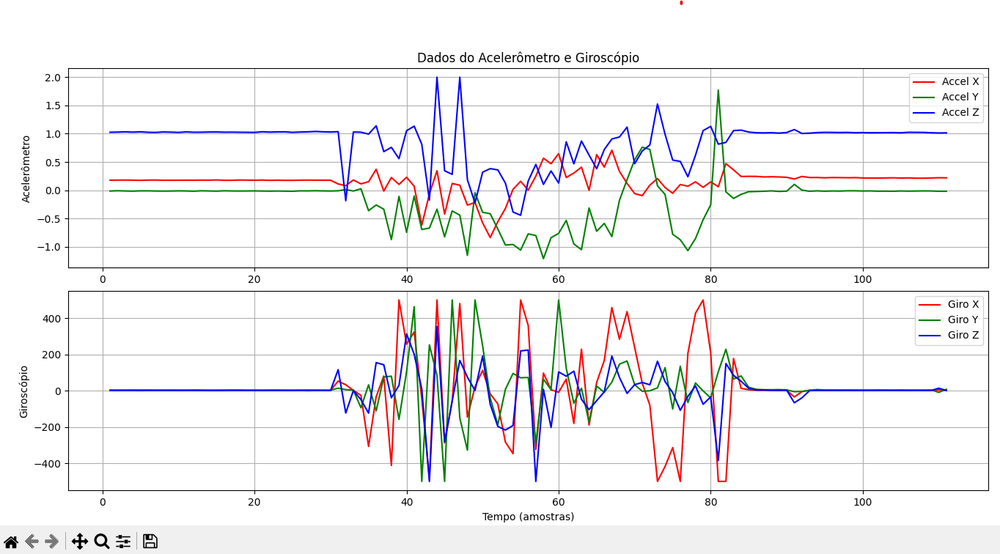

# **MPU-Logger**

**Sistema de Aquisição de Dados Inerciais com Raspberry Pi Pico**

Um data logger completo para capturar dados do sensor **MPU6050** (acelerômetro + giroscópio), armazená-los em um **cartão SD** e fornecer feedback visual via **LEDs RGB** e **display OLED**. Desenvolvido para Raspberry Pi Pico (RP2040).
No projeto foi utilizada a placa BitDogLab.

## **📌 Recursos**

✅ **Leitura de dados do MPU6050** (aceleração, giro e temperatura)  
✅ **Armazenamento em CSV** no cartão SD  
✅ **Interface visual** com display OLED (SSD1306)  
✅ **Feedback RGB** (LEDs para status e alertas)  
✅ **Controle por botões** (iniciar/parar gravação, montar SD)  
✅ **Comandos via terminal** (formatação SD, listagem de arquivos, etc.)

---

## **🛠️ Hardware Necessário**

- **Raspberry Pi Pico** (com RP2040)
- **Sensor MPU6050** (Acelerômetro + Giroscópio)
- **Cartão SD** (com módulo SPI)
- **Display OLED SSD1306** (I²C, 128x64)
- **LEDs RGB** (Vermelho, Verde, Azul)
- **Botões** (2x para controle)
- **Jumpers e protoboard**

---

## **⚙️ Configuração**

### **📋 Conexões**

| Componente          | Pino no Raspberry Pi Pico   |
| ------------------- | --------------------------- |
| **MPU6050 (I²C)**   | SDA: GPIO0, SCL: GPIO1      |
| **OLED (I²C)**      | SDA: GPIO14, SCL: GPIO15    |
| **LED Vermelho**    | GPIO13                      |
| **LED Verde**       | GPIO11                      |
| **LED Azul**        | GPIO12                      |
| **Botão A**         | GPIO5 (Gravação)            |
| **Botão B**         | GPIO6 (Montar/Desmontar SD) |
| **Módulo SD (SPI)** | Configuração padrão SPI     |

_(Consulte o código para mais detalhes de pinagem.)_

### **🔧 Instalação**

1. **Clone o repositório:**

   ```bash
   git clone https://github.com/Leo-Luz-code/MPU-Logger.git
   cd MPU-Logger
   ```

2. **Configure o ambiente:**

   - Instale o [SDK do Raspberry Pi Pico](https://github.com/raspberrypi/pico-sdk).
   - Compile com CMake (ou carregue via Thonny/PlatformIO).

3. **Grave o firmware no Pico:**
   - Use `uf2` ou `picotool`.

---

## **📊 Funcionamento**

### **🎛️ Controles**

- **Botão A**: Inicia/para gravação dos dados.
- **Botão B**: Monta/desmonta o cartão SD.
- **Terminal Serial**: Comandos para formatação, listagem de arquivos e mais.

### **📂 Armazenamento de Dados**

Os dados são salvos em **arquivos CSV** no cartão SD, no formato:

```csv
numero_amostra,accel_x,accel_y,accel_z,giro_x,giro_y,giro_z
1,1250,-320,9800,200,-150,30
2,1300,-300,9750,210,-145,32
...
```

Em seguida, utilizamos o código Python PlotaDados.py presente em **ArquivosDados/**



### **🌈 Feedback Visual**

| **LED**     | Estado                 |
| ----------- | ---------------------- |
| **Amarelo** | Inicialização          |
| **Verde**   | Sistema pronto         |
| **Ciano**   | Montando Cartão SD     |
| **Azul**    | Desmontando Cartão SD  |
| **Roxo**    | Pisca durante gravação |
| **Azul**    | Erro no SD             |

---

## **📜 Comandos do Terminal**

Digite no monitor serial (ex: PuTTY, Thonny):

- **`a`**: Monta o cartão SD.
- **`b`**: Desmonta o cartão SD.
- **`c`**: Lista arquivos no SD.
- **`d`**: Mostra conteúdo dos arquivos.
- **`e`**: Verifica espaço livre no SD.
- **`f`**: Inicia captura de dados.
- **`g`**: Formata o cartão SD _(cuidado!)_.
- **`h`**: Ajuda (mostra comandos).

---

## **📁 Estrutura do Código**

```plaintext
MPU-Logger/
├── ArquivosDados/          # Arquivo de dados capturados e gravados
├── lib/
│   ├── ssd1306.[ch]        # Driver OLED
│   ├── font.h              # Fontes do OLED
│   └── FatFs_SPI           # Biblioteca do FatFS
├── .gitignore              # Gitignore
├── CMakeLists.txt          # Configuração de build
├── Cartao_FatFS_SPI.c      # Código principal
├── hw_config.c             # Arquivo de configuração de hardware
├── LICENSE.txt             # Licença do MIT
└── README.md               # Este arquivo
```

---

## **📜 Licença**

MIT License.

---

**🎉 Contribuições são bem-vindas!**  
Se você melhorou este projeto, abra um **PR** ou uma **issue** no GitHub.

🔗 **Repositório**: [github.com/Leo-Luz-code/MPU-Logger](https://github.com/Leo-Luz-code/MPU-Logger)

---
